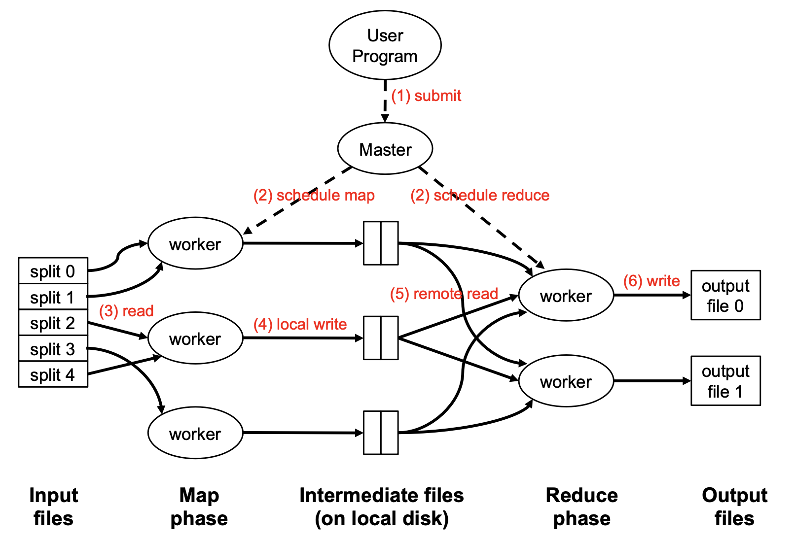

# MIT6.5840
2023Spring课程链接https://pdos.csail.mit.edu/6.824/schedule.html
# LAB1: MapReduce
MapReduce是一种编程模型，用于处理和生成大数据集。它最初由Google开发，后来成为处理大规模数据集的流行方法，尤其是在分布式计算环境中。MapReduce模型主要包括两个步骤：Map阶段和Reduce阶段。

Map阶段：在这个阶段，输入数据集被分成独立的小块，这些小块并行地由多个Map任务处理。每个Map任务处理一小块数据，并生成一组中间键值对（key-value pairs）作为输出。

Reduce阶段：接着，在Reduce阶段，对Map阶段输出的所有中间键值对进行处理。具有相同键的值被分组在一起，并传递给Reduce任务。每个Reduce任务接收某个键及其对应的值集合，然后合并这些值以形成一组较小的值集合。最终，Reduce阶段的输出可以是数据的一个新的、更小的集合，或是对数据的总结和分析结果。

本实验采用了最经典的word count任务：统计许多文件中的每个单词出现的次数。

在分布式系统中文件数量非常庞大，我们需要切分这些文件，在HDFS(Hadoop Distributed File system)中每个split通常是128MB，而GFS(Google File System)每个split通常是64MB。每个Map worker可以接收多个文件splits，然后将统计结果写入到本地磁盘中。在Map任务完成过后，Reduce workers读取这些中间文件，对结果进行汇总。由于执行Map任务和Reduce任务通常是不同的机器，这需要使用Network进行传输，通常为了减小Network I/O，每个Map worker可以选择对本地结果进行局部汇总后再传输给远程的Reduce worker. MapRduce执行过程如图(adopted from Bryan Hooi, NUS)：


# Sequential MapReduce
首先我们可以先从课程官网提供的Sequential版本的MapReduce入手，了解MapReduce的执行过程。Sequential这里意味着不采用分布式计算，一个机器完成所有的Map任务和Reduce任务。

首先我们需要简单的Map函数和Reduce函数：
```go
func Map(filename string, contents string) []mr.KeyValue {
	// function to detect word separators.
	ff := func(r rune) bool { return !unicode.IsLetter(r) }

	// split contents into an array of words.
	words := strings.FieldsFunc(contents, ff)

	kva := []mr.KeyValue{}
	for _, w := range words {
		kv := mr.KeyValue{Key: w, Value: "1"}
		kva = append(kva, kv)
	}
	return kva
}

func Reduce(key string, values []string) string {
	// return the number of occurrences of this word.
	return strconv.Itoa(len(values))
}
```
不难看出，Map函数这里将整个文件中的英文单词转换为了key-value pairs，比如: 
```
["hello": "1", "Mike": "1", "hello": "1", "Jerry": "1"]
```
如果这三个keys都映射到同一个Reduce worker中，那么排序整合后（之后会说明具体实现）的结果为:
```
["hello": ["1", "1"], "Mike": ["1"], "Jerry": ["1"]]
```
调用该Reduce函数便分别返回2、1、1。

这两个函数会提前将其编译，然后再运行时作为插件(plugin)动态加载到程序中:
```go
mapf, reducef := loadPlugin(os.Args[1])
```

我们已经知道Map任务是将英文单词转换为key-value pairs，然后将其写入中间文件（临时文件）中：
```go
intermediate := []mr.KeyValue{}
for _, filename := range os.Args[2:] {
	file, err := os.Open(filename)
	if err != nil {
		log.Fatalf("cannot open %v", filename)
	}
	content, err := io.ReadAll(file)
	if err != nil {
		log.Fatalf("cannot read %v", filename)
	}
	file.Close()
	kva := mapf(filename, string(content))
	intermediate = append(intermediate, kva...)
}
```
这里其实并没有创建真正的中间文件，只是写入到Array中，供后面的Reduce任务汇总。后面我们采用的分布式计算，需要将不同的keys映射到不同的Reduce workers中，即写入到不同的中间文件中。

我们对所有keys进行排序:
```go
sort.Sort(ByKey(intermediate))
```
这样同一个key就会聚集在一起，方便我们使用Reduce函数：
```go
oname := "mr-out-0"
ofile, _ := os.Create(oname)

//
// call Reduce on each distinct key in intermediate[],
// and print the result to mr-out-0.
//
i := 0
for i < len(intermediate) {
	j := i + 1
	for j < len(intermediate) && intermediate[j].Key == intermediate[i].Key {
		j++
	}
	values := []string{}
	for k := i; k < j; k++ {
		values = append(values, intermediate[k].Value)
	}
	output := reducef(intermediate[i].Key, values)

	// this is the correct format for each line of Reduce output.
	fmt.Fprintf(ofile, "%v %v\n", intermediate[i].Key, output)

	i = j
}

ofile.Close()
```
这样所有的keys和其对应的数量都会写入到"mr-out-0"文件中。完成了单个机器上的MapReduce任务。该部分具体代码文件在src/main/mrsequential.go中。
当然你会发现这里的默认Map函数并不高效，你可以选择使用in-mapper combiner策略，即汇总局部的结果，例如"hello" 统计为"2"再传给Reduce worker，当然也需要稍微修改一下Reduce函数。

# Distributed MapReduce
分布式MapReduce要求我们实现一个Coordinator(Master)来协调管理整个流程，当中有十分多的Map worker和Ruduce worker，他们共同合作来完成word count的任务。

一个Coordinator(Master)的作用是将任务分配给每个worker，如果某个任务在规定时间内没有被完成，那么它就需要重新将任务发送给worker去执行。首先，我们可以看到在src/main/mrcoordinator.go中创建了一个coordinator进程，并通过coordinator自身的Done方法来检查任务是否完成，每睡眠一秒检查一次以防止忙等待(busy-waiting)。若任务完成便退出。
```go
func main() {
	if len(os.Args) < 2 {
		fmt.Fprintf(os.Stderr, "Usage: mrcoordinator inputfiles...\n")
		os.Exit(1)
	}

	m := mr.MakeCoordinator(os.Args[1:], 10)
	for m.Done() == false {
		time.Sleep(time.Second)
	}

	time.Sleep(time.Second)
}
```
如果我们假设Coordinator自身的状态为FINISHIED便退出，那么Done方法的定义可以如下：
```go
var ret bool
func (c *Coordinator) Done() bool {
	// Your code here.
	c.mu.Lock()
	defer c.mu.Unlock()
	ret = c.state == FINISHIED
	return ret
}
```
接下来我们需要考虑身为一个Coordinator，我们需要给这个struct提供什么属性和方法呢？

```go
type Coordinator struct {
	// Your definitions here.
	state         string
	nReduce       int
	nMap          int
	taskQue       chan *Task
	finishedTasks int
	onGoingTask   map[int]*Task
	mu            sync.Mutex
}
```
这里我们分别记录了系统当前的状态、多少个reduce workers（模拟）、多少个map workers（模拟）、维护了一个等待任务队列（一个带有容量的channel）、已完成任务的数量、正在处理的任务队列（一个Hashmap）、和Coordinator专属的一把锁。

Coordinator会将文件块分配给不同的workers，本LAB要求将其简化为每个worker分配一整个文件。那么整体流程如下:
* Coordinator初始化为MAP状态，将任务送入等待任务队列。
* 另一端的Worker进程通过RPC间歇性地请求任务。
* Coordinator收到RPC后将任务队列的队首(任务)通过RPC传递过去，并将其记录在正在处理的任务队列中。
* Map worker完成任务后会再次调用RPC告知Coordinator我的任务已经完成。
* Coordinator收到RPC后，将其移出正在处理的任务队列，并增加已完成任务的数量。
* Coordinator会定时检查位于正在处理的任务队列中的任务是否超时，如果超时，会将其重新送入等待队列，并将其移出正在处理队列。
* 当worker请求任务并且Coordinator的等待队列没有任务的时候，Coordinator会发送一个"WAITTING"任务让其等待。
* Coordinator发现MAP任务数量达标后，会修改当前状态进入Reduce状态，完成上述类似操作。
* Coordinator发现REDUCE任务数量达标后，会修改当前状态进入Reduce状态，worker请求任务时会获得"QUIT"任务，直接退出。
* Coordinator最后实现状态从QUIT到FINISHED的转变，退出Coordinator进程。

如果只启动了一个worker进程，那么相当于是一个worker完成所有的Map任务和Reduce任务。

假如我们启动了两个worker进程，在MAP阶段，两个worker充当了不同的Mapper，通过RPC向Coordinator请求任务。当某个进程获得一个任务后，会完成Map task，将该文件拆分成key-value pairs，并将输出写入到nReduce个文件里。另一个worker进程也是一样。当所有的Map tasks分配完成后，如果某一个worker再次请求任务，会收到等待任务，进行等待。当Coordinator收到所有的Map tasks完成的消息后，便进入Reduce状态，此时这两个worker进程便充当了Reducer的身份，进行Reduce任务。

所以本实验中nReduce变量只是相当于模拟多个Reducers，本实验nReduce == 每个map任务写入中间文件的数量 == 最终输出文件数量。同样，nMap == Map tasks的数量 == 文件的数量。而真正需要达到nReduce的计算量，那么我们至少需要启动n个worker进程来完成Reduce任务。由于本例文件很小而且文件数量极少，多个worker进程的效果并不明显。

明白了大体流程后，我们就可以动手实现了，首先是初始化Coordinator操作：
```go
func MakeCoordinator(files []string, nReduce int) *Coordinator {
	c := Coordinator{}
	
	// Your code here.
	c.nReduce = nReduce
	c.nMap = len(files)
	c.taskQue = make(chan *Task, max(len(files), nReduce))
	c.mu = sync.Mutex{}
	c.state = MAP
	c.onGoingTask = make(map[int]*Task)
	c.finishedTasks = 0
	
	for i, filename := range files {
		// Create a map task.
		task := Task{
			ID:       i,
			Type:     MAP,
			FileName: filename,
			NReduce:  c.nReduce,
			NMap:     c.nMap,
			Deadline: -1,
		}
		c.taskQue <- &task
	}
	
	go c.detector()
	go c.server()
	return &c
}
```
其中涉及开启一个go程检查任务是否完成或者任务是否超时：
```go
func (c *Coordinator) detector() {
	for {
		c.mu.Lock()
		if c.state == MAP && c.finishedTasks == c.nMap ||
			c.state == REDUCE && c.finishedTasks == c.nReduce ||
			c.state == QUIT && c.finishedTasks == c.nReduce {
			c.changeState()
		} else {
			c.taskTimeout()
		}
		c.mu.Unlock()
		time.Sleep(200 * time.Millisecond)
	}
}
```
还涉及开启一个go程启动服务器监听RPC调用。本实验为了简化流程创立了本地socket来进行进程间通信，实际应用中涉及到网络传输需要建立tcp连接使用端口号。
```go
func (c *Coordinator) server() {
	rpc.Register(c)
	rpc.HandleHTTP()
	//l, e := net.Listen("tcp", ":1234")
	sockname := coordinatorSock()
	os.Remove(sockname)
	l, e := net.Listen("unix", sockname)
	if e != nil {
		log.Fatal("listen error:", e)
	}
	go http.Serve(l, nil)
}
```
如果detector发现任务完成需要切换状态，对于MAP --> REDUCE，我们需要具体说明task并将其添加到等待队列中，而对于REDUCE --> QUIT以及后续的切换，我们只需要在对方请求任务时发送简单的标识性任务或者直接终止即可。
```go
func (c *Coordinator) changeState() {
	if c.state == MAP {
		// Shift current state to Reduce
		c.state = REDUCE
		for i := 0; i < c.nReduce; i++ {
			// Create a reduce task.
			task := Task{
				ID:       i,
				Type:     REDUCE,
				NReduce:  c.nReduce,
				NMap:     c.nMap,
				Deadline: -1,
			}
			c.taskQue <- &task
			c.finishedTasks = 0
		}
	} else if c.state == REDUCE {
		DPrintln("QUIT!!!!")
		c.state = QUIT
	} else {
		DPrintln("FINISHED!!!!")
		c.state = FINISHIED
		os.Exit(0)
	}
}
```
对于超时任务的处理，我们先从正在处理队列中找到超时任务，将其重新加入等待处理队列，最后从运行队列中删除：
```go
func (c *Coordinator) taskTimeout() {
	// Check if there are any timeouts in the currently running tasks,
	// remove them from c.onGongingTask, and then re-add them to c.taskQue.
	tasksToDelete := []int{}
	for taskID, task := range c.onGoingTask {
		if time.Now().Unix() > task.Deadline {
			task.Deadline = -1
			c.taskQue <- task
			tasksToDelete = append(tasksToDelete, taskID)
		}
	}

	for _, key := range tasksToDelete {
		delete(c.onGoingTask, key)
	}
}
```
当worker请求任务时，如果等待队列不为空，我们将设定该任务超时时间，然后通过RPC传递该任务，并将该任务从等待队列中移动到正在处理队列；
如果等待队列中没有任务并且又不处于退出状态，向worker回复一个等待任务；
如果等待队列中没有任务且处于退出状态，向worker回复一个退出任务。
```go
func (c *Coordinator) RequestTask(args *RequestTaskArgs, reply *RequestTaskReply) error {
	c.mu.Lock()
	if len(c.taskQue) != 0 {
		task := <-c.taskQue
		task.Deadline = time.Now().Add(TIME_OUT).Unix()
		reply.Task = task
		c.onGoingTask[task.ID] = task
	} else if len(c.taskQue) == 0 && c.state != QUIT {
		reply.Task = &Task{Type: WAITING}
	} else {
		reply.Task = &Task{Type: QUIT}
	}
	c.mu.Unlock()
	return nil
}
```
worker通过RPC调用Coordinator的Done方法来告知Coordinator任务已完成：
```go
func (c *Coordinator) TaskDone(args *TaskDoneArgs, reply *TaskDoneReply) error {
	c.mu.Lock()
	delete(c.onGoingTask, args.ID)
	c.finishedTasks++
	c.mu.Unlock()
	return nil
}
```
Coordinator的属性和方法大致如上述，具体实现在src/mr/coordinator.go中。
接下来我们来看worker的实现：

最基本的我们需要具备请求任务功能并且可以通知Coordinator任务完成：
```go
func RequestTask() *Task {
	args := RequestTaskArgs{}
	reply := RequestTaskReply{}

	if ok := call("Coordinator.RequestTask", &args, &reply); !ok {
		log.Println("RequestTask call failed!")
	}
	return reply.Task
}

func sendTaskDone(taskId int, taskType string) {
	args := TaskDoneArgs{taskId, taskType}
	reply := TaskDoneReply{}

	if ok := call("Coordinator.TaskDone", &args, &reply); !ok {
		log.Println("sendTaskDone failed!")
	}
}
```
接下来我们需要初始化一个worker进程(mrworker.go会调用这个函数来创建worker进程)：
```go
func Worker(mapf func(string, string) []KeyValue,
	reducef func(string, []string) string) {

	// Your worker implementation here.
	for {
		task := RequestTask()

		switch task.Type {
		case MAP:
			MapTask(task, mapf)

		case REDUCE:
			ReduceTask(task, reducef)

		case WAITING:
			DPrintln("Waitng...")
			time.Sleep(100 * time.Millisecond)

		case QUIT:
			os.Exit(0)
		}

		time.Sleep(200 * time.Millisecond)
	}
}
```
最后便是一个worker的核心功能，进行Map或者Reduce任务。

需要注意的是测试程序会选择直接终止Map任务或Reduce任务来模拟机器崩溃，这就意味着我们要防止某个文件写入到一半终止后，该不完整的文件被后续Reduce任务所读取，产生不必要的错误。
因此我们采用课程官网提到的小技巧，将所有任务输出文件先写入到临时文件中，等该worker当前任务完成后（这里指所有文件写入完毕后），我们再将其修改为真正的中间文件名供Reducer读取。
```go
func MapTask(task *Task, mapf func(string, string) []KeyValue) {
	// Open the input file.
	filename := task.FileName

	file, err := os.Open(filename)
	if err != nil {
		log.Fatalf("cannot open %v", filename)
	}
	content, err := io.ReadAll(file)
	if err != nil {
		log.Fatalf("cannot read %v", filename)
	}
	file.Close()

	kva := mapf(filename, string(content))

	// Map a key to its corresponding reducer, and write it to a bucket (partitioning).
	buckets := make(map[int][]KeyValue)
	nReduce := task.NReduce
	for _, kv := range kva {
		index := ihash(kv.Key) % nReduce
		buckets[index] = append(buckets[index], kv)
	}

	// Prepare to keep track of temp files and their intended final names.
	tempFiles := make(map[string]string)

	// Write each bucket into a separate intermediate file.
	for i := 0; i < nReduce; i++ {
		// Create a temporary file
		tempFile, err := os.CreateTemp(".", "temp_map_")
		if err != nil {
			log.Fatalf("Failed to create temporary file: %v", err)
		}
		tempFileName := tempFile.Name()
		finalFileName := getIntermediateFileName(task.ID, i)
		tempFiles[tempFileName] = finalFileName

		// Write key/value pairs in JSON format to the temporary file
		enc := json.NewEncoder(tempFile)
		kvs := buckets[i]
		for _, kv := range kvs {
			if err := enc.Encode(&kv); err != nil {
				log.Fatalf("Fail to encode kv: %v", err)
			}
		}
		// Close the temporary file
		tempFile.Close()
	}

	// Rename all temporary files to their final names
	for tempFileName, finalFileName := range tempFiles {
		if err := os.Rename(tempFileName, finalFileName); err != nil {
			log.Fatalf("Failed to rename file from %s to %s: %v", tempFileName, finalFileName, err)
		}
	}

	go sendTaskDone(task.ID, task.Type)
}
```
对于Reduce任务也是一样，要防止任务中断导致输出文件不完整而被用户当作正常文件，因此我们也需要最后的文件重命名：
```go
func ReduceTask(task *Task, reducef func(string, []string) string) {
	nMap := task.NMap
	intermediate := make([]KeyValue, 0)
	// Read corresponding key-value pairs from mappers' outputs.
	for i := 0; i < nMap; i++ {
		rFile, err := os.Open(getIntermediateFileName(i, task.ID))
		if err != nil {
			log.Println("Open intermediate file failed!")
		}
		// Decode the file.
		dec := json.NewDecoder(rFile)
		for {
			var kv KeyValue
			if err := dec.Decode(&kv); err != nil {
				break
			}
			intermediate = append(intermediate, kv)
		}
	}
	// Sorting
	sort.Sort(ByKey(intermediate))
	tempFile, _ := os.CreateTemp(".", "temp_reduce_")
	i := 0
	for i < len(intermediate) {
		j := i + 1
		for j < len(intermediate) && intermediate[j].Key == intermediate[i].Key {
			j++
		}
		values := []string{}
		for k := i; k < j; k++ {
			values = append(values, intermediate[k].Value)
		}
		output := reducef(intermediate[i].Key, values)

		// This is the correct format for each line of Reduce output.
		fmt.Fprintf(tempFile, "%v %v\n", intermediate[i].Key, output)

		i = j
	}

	tempFileName := tempFile.Name()
	tempFile.Close()

	for i := 0; i < nMap; i++ {
		os.Remove(getIntermediateFileName(i, task.ID))
	}

	finalFileName := getOutputFileName(task.ID)
	if err := os.Rename(tempFileName, finalFileName); err != nil {
		log.Fatalf("Failed to rename file from %s to %s: %v", tempFileName, finalFileName, err)
	}
	DPrintln(task.ID, task.Type)
	go sendTaskDone(task.ID, task.Type)
}
```
对于输出文件的命名，采用了官网推荐的方式：
* Map任务：mr-X-Y
* Reduce任务：mr-out-Y
```go
func getIntermediateFileName(mapId int, reduceId int) string {
	return fmt.Sprintf("mr-%d-%d", mapId, reduceId)
}

func getOutputFileName(reduceNumber int) string {
	return fmt.Sprintf("mr-out-%d", reduceNumber)
}
```
至于他们的前身临时文件，采用了"temp_map_X"和"temp_reduce_Y"的方式，可自行命名（能与正式文件区分即可）
# LAB2: Raft
Raft官网的可交互性动画对于理解论文中的细节非常有帮助https://raft.github.io
Raft是分布式系统中理解起来相对容易的一致性算法/协议。一致性对于fault-tolerant systems非常重要，Raft通过几个重要的特性来实现一致性（论文Figure 3）：
*  __Election Safety__: at most one leader can be elected in a given term.
*  __Leader Append-Only__: a leader never overwrites or deletes entries in its log; it only appends new entries.
*  __Log Matching__: if two logs contain an entry with the same index and term, then the logs are identical in all entries up through the given index.
*  __Leader Completeness__: if a log entry is committed in a given term, then that entry will be present in the logs of the leaders for all higher-numbered terms.
*  __State Machine Safety__: if a server has applied a log entry at a given index to its state machine, no other server will ever apply a different log entry for the same index.

换言之：
* 某一任期只有一个Leader。
* Leader不会删除自己的日志条目，只会增加。
* 当两个日志中的某条目索引和该条目的任期匹配，我们才说这两个日志匹配。
* 如果某一个日志的条目被提交了，那么后续的领导者一定有这一部分条目（条目需要大多数机器拥有才可以提交 + 拥有最新条目的Raft才可以被选举为Leader）。
* 同一个索引的条目不可以被多次提交。

本LAB中无论Raft是Follower，Leader，还是Candidate，它们之间都通过RPC来交换信息。
大概流程是这样的：

服务层调用Make()来创建一个个Raft peer，创建完成之后，会时不时的向各个Raft发送command信息（通过调用Start(command)），当然只有Leader才会应答。在这个过程中我们需要顺利完成选举过程，并且Leader需要顺利地将日志条目发送给其他机器。当大部分机器都收到该条目后，Leader会在下一次的RPC中通过commitIndex来告知其他选手我已经把这之前的信息都应用到状态机，其他选手才可以应用到状态机。本LAB通过模拟将应用的信息通过apply channel发送给测试程序来模拟这个应用的过程。想要通过所有测试程序，需要考虑到所有苛刻的条件：例如某个Raft突然崩溃，网络不稳定造成疯狂丢包，而且有些测试程序需要你在规定时间完成，因此需要加速某一部分代码使得Follower尽快赶上Leader的进度... 在后续的日志持久化和应用快照部分会将你本可以通过2A、2B测试的代码存在的问题都暴露出来。

想要完成本LAB，一个Raft Structure大概如下：
```go
type Raft struct {
	mu        sync.Mutex          // Lock to protect shared access to this peer's state
	peers     []*labrpc.ClientEnd // RPC end points of all peers
	persister *Persister          // Object to hold this peer's persisted state
	me        int                 // this peer's index into peers[]
	dead      int32               // set by Kill()

	// Your data here (2A, 2B, 2C).
	// Look at the paper's Figure 2 for a description of what
	// state a Raft server must maintain.

	// Persistent state on all servers:
	currentTerm int
	votedFor    int
	log         []Log
	// for snapshot
	lastIncludedIndex int
	lastIncludedTerm  int

	// Volatile state on all servers:
	commitIndex int
	lastApplied int
	snapShot    []byte

	// Volatile state on leaders:
	nextIndex  []int
	matchIndex []int

	// Other states:
	rule      int
	voteCount int
	time      *Time
	applyChan chan ApplyMsg
}

```

在进行这个LAB时，你可能遇到低级错误如：死锁、数组超出索引（逻辑错误导致）、抑或是没注意到论文中的细节导致没有达成一致、抑或是没有“迎合”测试程序，而导致测试不通过。我这里有几条Debug经验之谈：

* __Dprintf__:这是MIT推荐的“笨办法”，但也是最直截了当最快定位问题所在的办法！在你怀疑的地方打印尽可能详细的信息。
* 不要放过论文中的细节，有时候论文中的细节还不够，可以去官网动画自定义case来解决你的疑惑！
* 当你以为抓住了所有细节也没发现问题，那就可以去测试程序那里找答案，虽然阅读大量的测试程序非常折磨。。。但正是这样我才发现了我在应用快照导致的死锁问题是测试程序和我共同产生的：我在SnapShot函数里向channel发送快照，但是同时测试程序里需要在调用SnapShot返回后才会从channel里接受信息。要么我修改测试程序，在SnapShot调用前加go，要么我不在这个函数里应用快照。所以如果你不知道测试函数的具体应用，即使你的逻辑正确，也可能会过不了测试。

# 2A: Leader election
选举Leader的大致流程就是某一个Follower等待Leader的信息超时，变身为Candidate，然后向其他人request votes，如果获得超半数的选票便成为Leader，向其他人发送AppendEntries命令（并不是真的有日志条目）。如何才能获得他人的选票和如何才能保持Leader身份论文中有详细描述，有些模糊的细节你可以在官网动画中私人定制来获取😎。注意发送RPC频率不能太快不然会过不了RPCs aren't too high的测试。

# 2B: Log
这一部分是Raft中的核心部分，上层service通过Start函数向各个Raft发送command,Leader会正确回应这个条目将会出现的Index。我一直觉得这一部分的回复无关紧要，后来才知道测试程序会检验你的Apply channel中的index是否与你回复Start的index一致。另外重要的一点，回复给服务层的索引是从1开始的，所以在写apply函数的时候注意这一点就可以了。

另外需要注意的是，如果Leader的选举过程过慢或者频繁触发选举过程会导致后面的测试难以通过。要把握好Follower的超时时间和Leader发送HeartBeat的时间。Lab官网对这一部分也有解释。

# 2C: Persistence
机器崩溃时会从readPersist中加载它崩溃前持久化的各个参数。只需要在每个修改持久化参数的地方调用persist即可。

NOTICE: 这一部分需要对Leader和Follower之间的通信进行加速，否则长时间不能达成一致会过不了测试。如果Leader发送的日志条目的索引和任期与Follower不符，我2B的解决方案是通过RPC call一次次递减index，直到Leader和Follower达成一致，但是如果Log中的日志条目过多的时候这样会很慢。因为在本Lab中，测试程序会模拟网络丢包过程！有一定几率会将Request和Reply信息直接丢掉（相关代码应该是在labrpc中），或者某台机器崩溃，或者将某台机器断网 —— 例如收不到任何消息却仍然以为自己是Leader不停发送AppendEntries的信息。所以快速达成一致是防止发生以上意外情况导致测试失败的关键。

课程官网给出的建议是在Follower回复的消息中增加关键信息：
* XTerm:  term in the conflicting entry (if any)
* XIndex: index of first entry with that term (if any)
* XLen:   log length

Leader处理流程如下：
* Case 1: leader doesn't have XTerm:
    nextIndex = XIndex
* Case 2: leader has XTerm:
    nextIndex = leader's last entry for XTerm
* Case 3: follower's log is too short:
    nextIndex = XLen

当然你可以有自己的加速方式，如果对某种情况不理解应该怎么处理，直接去官网动画中定制的你的疑惑即可。

# 2D: Log compaction
随着Log的不断扩大，不断占用内存空间，我们需要删除旧的Log，而将旧的部分信息保存在snapshot中。如果一个Leader发现某一个Follower太过落后以至于现存的Log无法将它的信息补全，那么就会向它发送快照。此外，service也会向各个Raft发送snapshot，表示某些信息已经过时了，你可以删掉了。这两部分都可以确保一个Follower快速跟上Leader的步伐。

那么service的snapshot从哪里来的呢，查看测试程序可以发现，当日志条目达到某一个数量时，他会直接将你的Log entries编码然后调用SnapShot，这是在接受raft apply信息的过程中顺便做的。也正是如此，我们不应该在SnapShot中将快照应用到状态机（逻辑上本该是这样的），因为channel这边你在发送快照，channel那面需要等待SnapShot函数执行完后才从channel中接受数据，因此在SnapShot发送快照会导致Dead Lock!如果非要发送，将测试程序调用该函数前加一个'go'就可以了。

我在做这一部分的时候，除了遇到上述死锁问题，测试程序告诉我Failed to reach agreement!我百思不得其解，终于发现从测试程序中发现端倪。

当Raft崩溃重启时，我之前的理解是，lastCommitIndex也就是最后提交的index应该是读取快照的lastIncluded Index，也就是快照的最后一个index。因为既然我们已经持久化了快照信息，为何不利用快照信息而获得尽可能最新的信息呢。但是测试程序偏不，他将所有的lastCommitedIndex都设置成0，也就是程序索引中的-1。也就是崩溃重启时，每个Raft最后提交的索引直接重置好似为什么事没发生过😡。在没有持久化快照信息前的2B/2C部分，这样做非常有道理，但是有了快照为何不用呢？当我发现这个问题时已经debug到几乎失去耐心，于是我直接将测试程序中的重启代码稍微修改了一下（过不了就修改他🤣），将他重启的lastCommitIndex设置成我认为的lastIncluded Index+1而不是0。所以如果你持久化了快照相关信息，请不要在lastCommitIndex上做功夫，否则会过不掉测试。

所以有时候过不掉测试的原因并不是你的逻辑错误，而是你和测试程序的逻辑不相符。遇到这种问题就需要花费大量时间，排出前面所有情况，并尝试去理解测试程序的逻辑。
